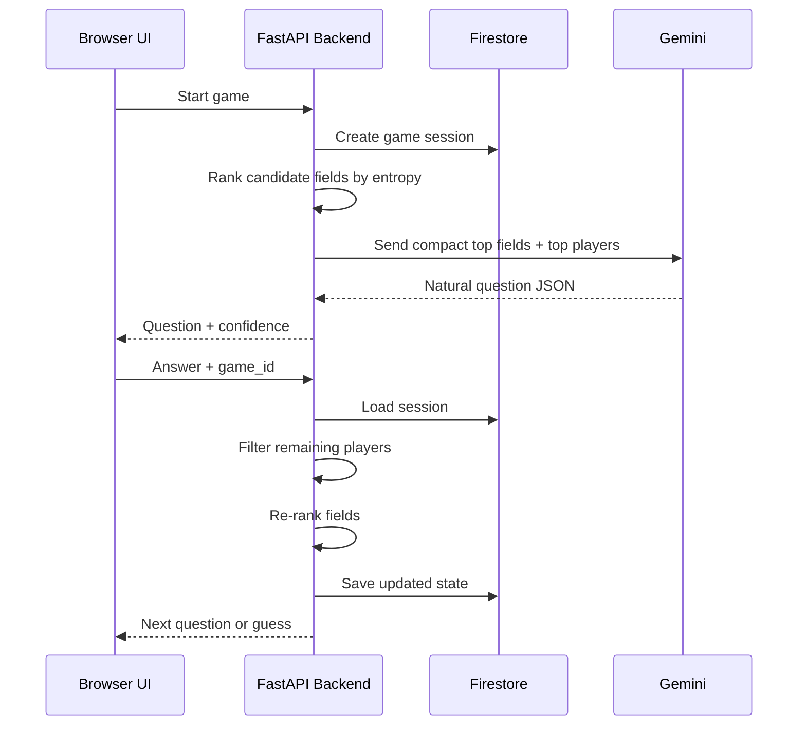
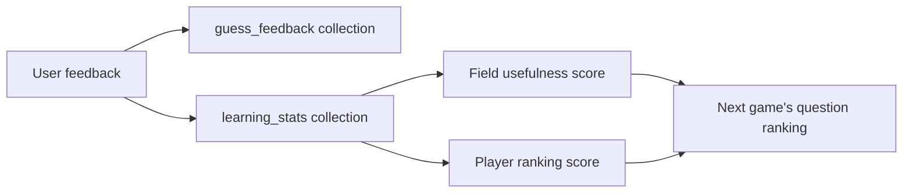
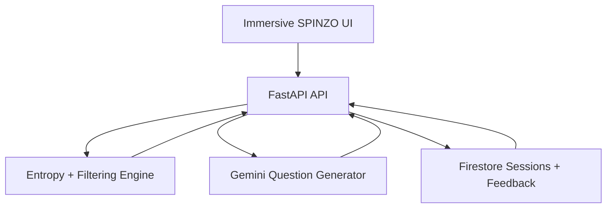

# SPINZO: Judge-Ready Optimization Notes

## One-Line Technical Story

SPINZO started as a broad LLM-driven IPL guessing game and was optimized into a hybrid AI system: deterministic entropy-based filtering handles the heavy reasoning, while Gemini is used only for natural question wording and final conversational polish.

## Key Metrics To Show

| Area | Before | After | Impact |
| --- | ---: | ---: | --- |
| Player knowledge sent to LLM | Full player JSON, about 847,905 to 1,219,374 characters | Ranked field splits + top-5 player summary, about 1,547 characters | About 99.8% smaller prompt payload |
| Approx token load per turn | About 211k to 305k tokens if full player data is sent | About 387 tokens for the optimized decision payload | Reduced from hundreds of thousands to a few hundred core data tokens |
| Player pool | 161 IPL players | 161 IPL players | Same coverage, lower cost |
| Candidate fields considered | 27 structured traits | Top 5 entropy-ranked traits sent to Gemini | Less context, better question quality |
| Question budget | Unbounded / model-dependent | Max 10 questions | Predictable game length |
| Game state | Client-side history / prompt-heavy context | Server-side game session with remaining player IDs | Smaller requests and reliable session recovery |
| Learning loop | Static guessing behavior | Firestore feedback updates field/player usefulness | Improves over time from user feedback |

## Optimization 1: Token Compression

What changed:
- We stopped sending the full player dataset to the model.
- The backend calculates the best question dimensions first.
- Gemini receives only:
  - Top 5 entropy-ranked fields.
  - Top 5 remaining player summaries.
  - Compact question history.

Judge pitch:
> We reduced LLM context from hundreds of thousands of tokens to a few hundred core decision tokens per turn, while keeping the full 161-player knowledge base available on the backend.

Graph idea:
- Bar chart: `Full Player Data Tokens` vs `Optimized Prompt Tokens`.
- Values:
  - Full pretty JSON estimate: `304,844`
  - Full minified JSON estimate: `211,977`
  - Optimized decision payload estimate: `387`

## Optimization 2: Entropy-Based Question Selection

What changed:
- Each candidate field is scored by how evenly it splits remaining players.
- High-entropy fields are prioritized because they eliminate more possibilities.
- Already asked fields are skipped.

Example first-turn field scores:

| Field | Yes | No | Entropy |
| --- | ---: | ---: | ---: |
| known_for_wickets | 80 | 81 | 1.0000 |
| known_for_big_runs | 65 | 96 | 0.9731 |
| known_for_sixhitting | 52 | 109 | 0.9076 |
| is_indian | 113 | 48 | 0.8790 |
| international_star | 48 | 113 | 0.8790 |

Judge pitch:
> Instead of asking random or purely model-generated questions, SPINZO ranks possible questions by information gain. The model becomes the language layer, not the entire reasoning engine.

Graph idea:
- Horizontal bar chart: top candidate fields by entropy.
- Diagram: player pool splitting into Yes/No branches after every answer.

## Optimization 3: Server-Side Candidate State

What changed:
- The backend stores `remaining_player_ids`, `asked_questions`, answer history, confidence, and turn count.
- The client only sends the user's answer and game ID.
- The backend filters candidates deterministically.

Judge pitch:
> We moved reasoning state from the browser prompt into a backend session, making every request smaller and less fragile.

Diagram:

## Optimization 4: Confidence and Early Guess Control

What changed:
- Confidence is calculated from:
  - Remaining candidate count.
  - Elimination progress.
  - Turn progress.
- The backend guesses when confidence is high, the pool is small, or the 10-question limit is reached.

Judge pitch:
> The game has predictable pacing: it avoids endless questioning, but also avoids guessing too early unless confidence is justified.

Graph idea:
- Line chart: question number vs confidence percentage.
- Overlay: remaining candidates decreasing over turns.

## Optimization 5: Feedback-Driven Learning

What changed:
- After each final guess, user feedback is stored.
- Correct and wrong counts update learning statistics for:
  - Question fields.
  - Guessed players.
  - Actual revealed players.
- Future games can weight useful fields higher.

Judge pitch:
> SPINZO is not just a one-shot prompt. It records outcomes and adjusts future question ranking using real user feedback.

Diagram:

## Optimization 6: Resilient Architecture

What changed:
- FastAPI exposes clear endpoints:
  - `POST /game/start`
  - `POST /game/answer`
  - `POST /game/feedback`
  - `GET /health`
- Firestore has an in-memory fallback path for local/dev resilience.
- The frontend validates backend responses before updating UI.
- CORS is configurable through environment variables.

Judge pitch:
> The app is split into clean layers: UI, API, deterministic engine, LLM layer, and persistence. That makes the project easier to demo, debug, and scale.

Diagram:

## Slide Suggestions

1. Problem: "LLM-only guessing is expensive, slow, and inconsistent."
2. Architecture: show the UI -> FastAPI -> entropy engine -> Gemini -> Firestore diagram.
3. Token Optimization: bar chart showing 211k/305k tokens vs 387 tokens.
4. Question Intelligence: entropy table and Yes/No split diagram.
5. Learning Loop: feedback improves future field and player ranking.
6. Demo Metrics: 161 players, 27 traits, top 5 fields sent, max 10 questions.

## Short Judge Script

> Our biggest technical decision was not to make Gemini do everything. We built a deterministic reasoning layer around the LLM. The backend holds the full IPL knowledge base, calculates which traits split the remaining player pool best, and sends Gemini only the top-ranked fields plus a tiny summary of likely candidates. This brought the prompt payload down by about 99.8%, from hundreds of thousands of potential tokens to a few hundred core decision tokens. On top of that, Firestore stores every game session and feedback result, so SPINZO can learn which questions and guesses perform better over time.
